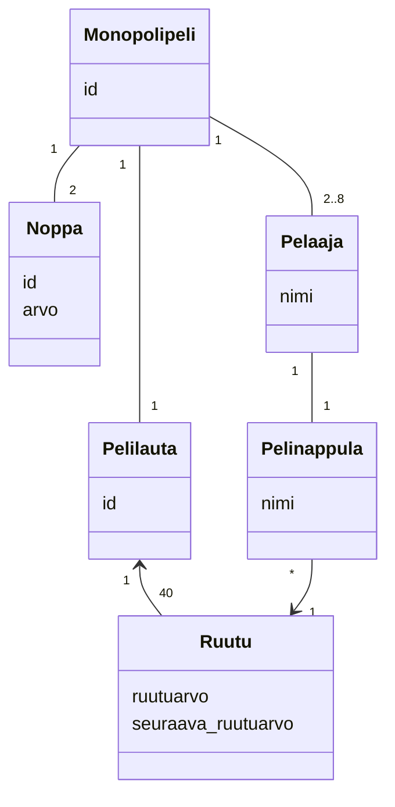

## Sovelluslogiikka Monopoli

```mermaid
 classDiagram
      Monopolipeli "1" -- "2" Noppa
      Monopolipeli "1" -- "2..8" Pelaaja
      Monopolipeli "1" -- "1" Pelilauta
      Pelaaja "1" -- "1" Pelinappula
      Pelilauta "1" <-- "40" Ruutu
      Pelinappula "*" --> "1" Ruutu
      class Monopolipeli{
          id
          
      }
      class Noppa{
          id
	  arvo
          
      }
	class Pelaaja{
          nimi
          
          
      }
	class Pelilauta{
	  id
                    
          
      }
	class Ruutu{
          ruutuarvo
          seuraava_ruutuarvo
          
      }
	 class Pelinappula{
          nimi
          
          
      }

```
