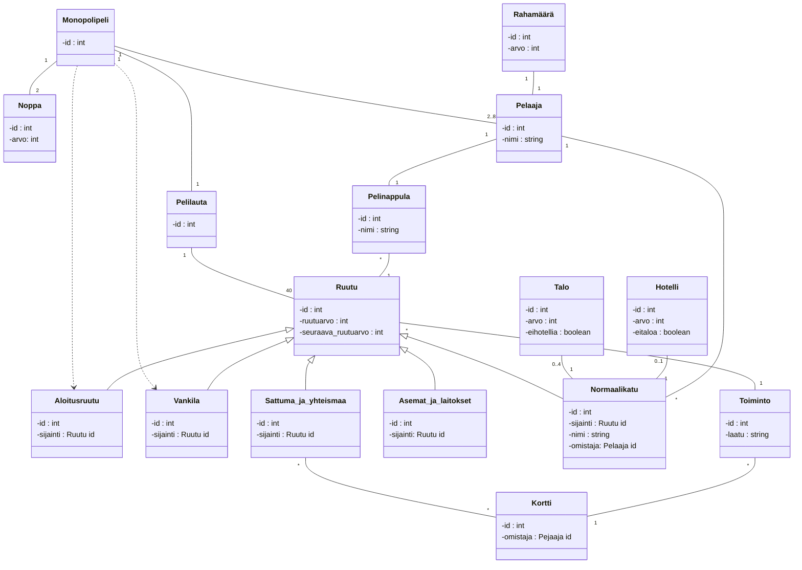

## Sovelluslogiikka Laajennettu Monopoli

```mermaid
 classDiagram
      Monopolipeli "1" -- "2" Noppa
      Monopolipeli "1" -- "2..8" Pelaaja
      Monopolipeli "1" -- "1" Pelilauta
      
      Monopolipeli  ..>  Aloitusruutu
      Monopolipeli  ..>  Vankila
      
      Pelaaja "1" -- "1" Pelinappula
      Pelilauta "1" -- "40" Ruutu
      Pelinappula "*" -- "1" Ruutu
      
      Ruutu  <|-- Aloitusruutu 
      Ruutu  <|--  Vankila
      Ruutu  <|--  Sattuma_ja_yhteismaa
      Ruutu  <|--  Asemat_ja_laitokset
      Ruutu  <|--  Normaalikatu    
      Ruutu "*" -- "1" Toiminto
      
      Sattuma_ja_yhteismaa "*" -- "*" Kortti
      Toiminto "*" -- "1" Kortti
      Talo "0..4" -- "1" Normaalikatu
      Hotelli "0..1" -- "1" Normaalikatu
      Normaalikatu "*"-- "1" Pelaaja
      Rahamäärä "1" -- "1" Pelaaja
      
      
      class Monopolipeli{
          -id : int
          
      }
      class Noppa{
          -id : int
	  -arvo: int
   
      }
	class Pelaaja{
	  -id : int
          -nimi : string
	    
      }
	class Pelilauta{
	  -id : int
                         
      }
      
	class Ruutu{
	  -id : int
          -ruutuarvo : int
          -seuraava_ruutuarvo : int
          
      }
	 class Pelinappula{
	  -id : int
          -nimi : string   
      }
      
      class Aloitusruutu{
          -id : int
          -sijainti : Ruutu id
     
     }
       class Vankila{
          -id : int
          -sijainti : Ruutu id   
      }
      
       class Sattuma_ja_yhteismaa{
          -id : int
          -sijainti : Ruutu id 
      }
      
      class Asemat_ja_laitokset{
      	-id : int
      	-sijainti: Ruutu id
      }
      
      class Normaalikatu{
          -id : int
          -sijainti : Ruutu id
          -nimi : string
	  -omistaja: Pelaaja id    
      }
      
      class Toiminto{
          -id : int
          -laatu : string
      }
      
      class Kortti{
          -id : int
          -omistaja : Pejaaja id
      }
      
      class Talo{
          -id : int
          -arvo : int
          -eihotellia : boolean
      }
      
      class Hotelli{
      -id : int
      -arvo : int
      -eitaloa : boolean
      }
      
       class Rahamäärä{
      -id : int
      -arvo : int
      }
       

```
