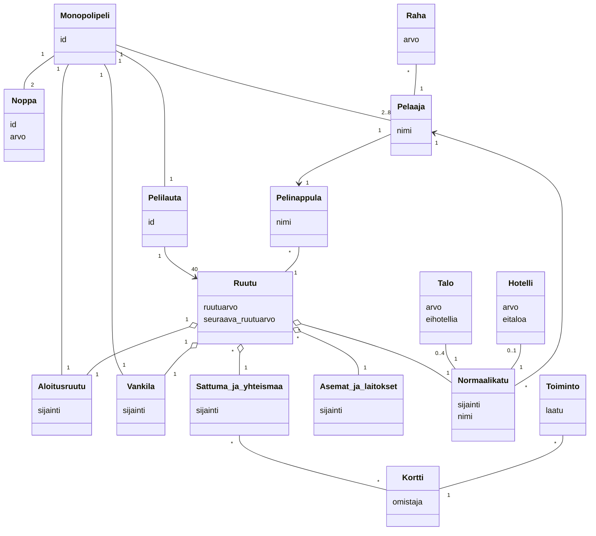

## Sovelluslogiikka Laajennettu Monopoli

```mermaid
 classDiagram
      Monopolipeli "1" -- "2" Noppa
      Monopolipeli "1" -- "2..8" Pelaaja
      Monopolipeli "1" -- "1" Pelilauta
      
      Monopolipeli "1" -- "1" Aloitusruutu
      Monopolipeli "1" -- "1" Vankila
      
      Pelaaja "1" --> "1" Pelinappula
      Pelilauta "1" --> "40" Ruutu
      Pelinappula "*" -- "1" Ruutu
      
      Ruutu "1" o-- "1" Aloitusruutu 
      Ruutu "1" o-- "1" Vankila
      Ruutu "*" o-- "1" Sattuma_ja_yhteismaa
      Ruutu "*" o-- "1" Asemat_ja_laitokset
      Ruutu "*" o-- "1" Normaalikatu    
      
      Sattuma_ja_yhteismaa "*" -- "*" Kortti
      Toiminto "*" -- "1" Kortti
      Talo "0..4" -- "1" Normaalikatu
      Hotelli "0..1" -- "1" Normaalikatu
      Normaalikatu "*"--> "1" Pelaaja
      Raha "*" -- "1" Pelaaja
      
      
      class Monopolipeli{
          id
          
      }
      class Noppa{
          id
	  arvo
          
      }
	class Pelaaja{
          nimi
          
          
      }
	class Pelilauta{
	  id
                    
          
      }
	class Ruutu{
          ruutuarvo
          seuraava_ruutuarvo
          
      }
	 class Pelinappula{
          nimi
          
          
      }
      class Aloitusruutu{
          sijainti
     
     }
       class Vankila{
          sijainti
          
          
      }
       class Sattuma_ja_yhteismaa{
          sijainti
          
          
      }
      class Asemat_ja_laitokset{
      sijainti
      
      }
      class Normaalikatu{
          sijainti
          nimi  
          
      }
      class Toiminto{
          laatu
            
     
      }
      class Kortti{
          omistaja
           
     
      }
      class Talo{
          arvo
          eihotellia
              
     
      }
      class Hotelli{
      arvo
      eitaloa
      }
      
      class Raha{
      arvo
      
      }
      

```
