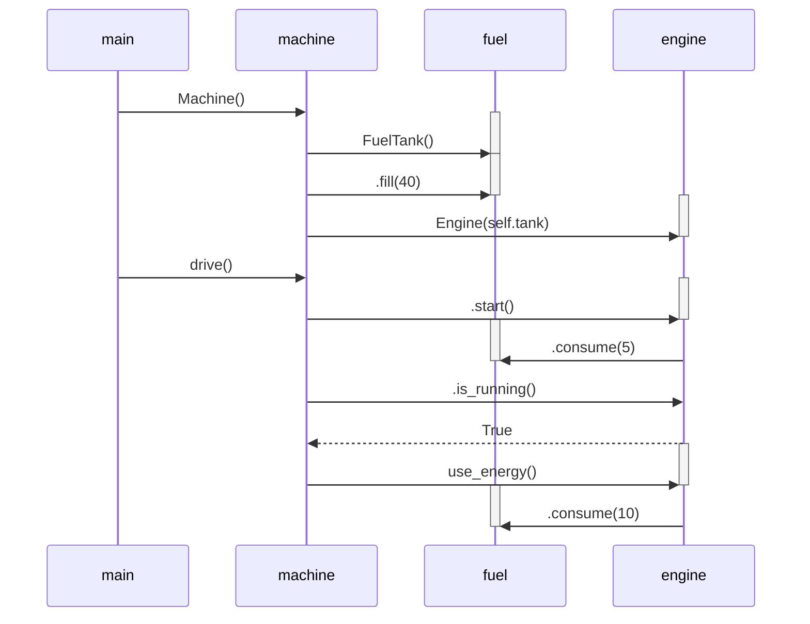

## Sekvenssikaavio

```mermaid

sequenceDiagram
    main->>machine: Machine()
    activate fuel
    machine->> fuel: FuelTank()
    deactivate fuel
    activate fuel
    machine->> fuel: .fill(40)
    deactivate fuel
    activate engine
    machine->> engine: Engine(self.tank)
    deactivate engine
    main ->> machine: drive()
    activate engine
    machine->> engine: .start()
    deactivate engine
    activate fuel
    engine ->> fuel: .consume(5)
    deactivate fuel
    machine ->> engine: .is_running()
    engine-->> machine: True
    activate engine
    machine ->> engine: use_energy()
    deactivate engine
    activate fuel
    engine ->> fuel: .consume(10)
    deactivate fuel
    
    
    
    
      

```
