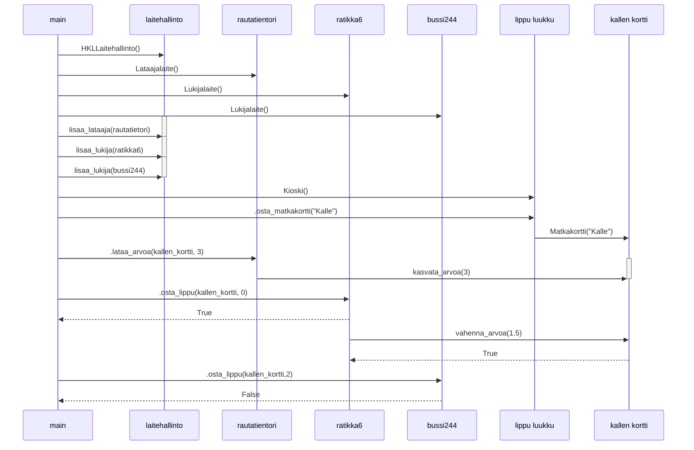

## Laajennettu Sekvenssikaavio

```mermaid

sequenceDiagram
    main ->>laitehallinto: HKLLaitehallinto()
    main ->> rautatientori: Lataajalaite()
    main ->> ratikka6 : Lukijalaite()
    main ->> bussi244 : Lukijalaite()
    activate laitehallinto
    main ->> laitehallinto:lisaa_lataaja(rautatietori)
    deactivate laitehallinto
    activate laitehallinto
    main ->> laitehallinto: lisaa_lukija(ratikka6)
    deactivate laitehallinto
    activate laitehallinto
    main ->> laitehallinto: lisaa_lukija(bussi244)
    deactivate laitehallinto
   
    main ->> lippu luukku: Kioski()
    main ->> lippu luukku: .osta_matkakortti("Kalle")
    lippu luukku ->> kallen kortti: Matkakortti("Kalle")
    main ->> rautatientori: .lataa_arvoa(kallen_kortti, 3)
    activate kallen kortti
   rautatientori->> kallen kortti: kasvata_arvoa(3)
   deactivate kallen kortti

    main ->> ratikka6: .osta_lippu(kallen_kortti, 0)
    ratikka6 -->> main: True
    ratikka6 ->> kallen kortti : vahenna_arvoa(1.5)
    kallen kortti -->> ratikka6: True

    main ->> bussi244: .osta_lippu(kallen_kortti,2)
    bussi244 -->> main:  False
    
  


    
    
    
    
     

```
