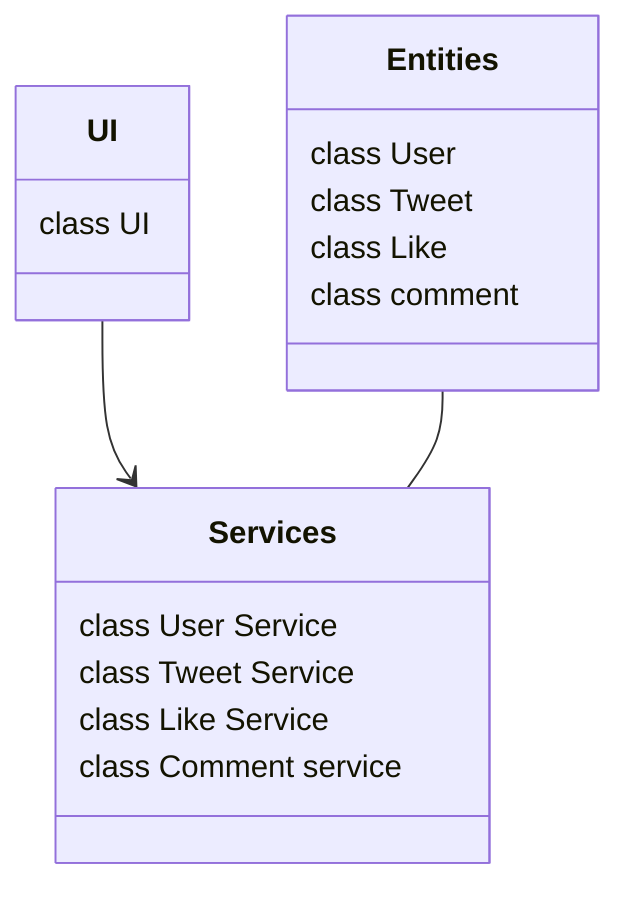
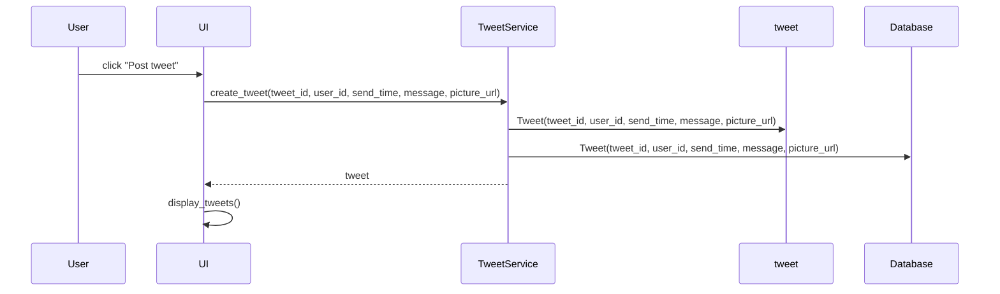

# Architecture description

## Structure

The program follows a two-level layer architecture, as following:

## User Interface

The class UI hoolds the four different views:
- login
- register
- dashboard
- comment

The UI also does light application logic such as raising errors. The UserService, TweetService, LikeService and CommentService hold all the code that interact with the SQLite  database and render the data back to the UI.

## Sequence diagram 

### Creation of Tweet

After clicking "post tweet" the program continues as follows:

Adding Users, Likes and comments follow a very similar pattern. 

## Database 

The function *initialize_database* creates four tables
- User
- Tweet
- Like
- Comment

