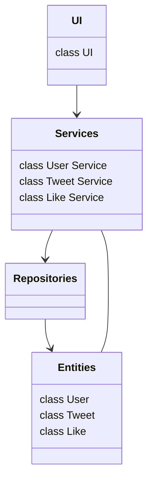
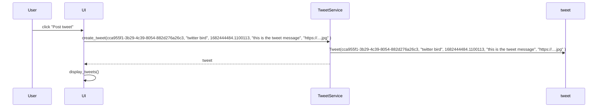

```mermaid
 classDiagram
      UI -->  Services
      Entities -- Services
      Services --> Repositories
      Repositories --> Entities
      class Services{
          class User Service
          class Tweet Service
          class Like Service
      }
      class UI{
          class UI
      }
      class Entities {
        class User
        class Tweet
        class Like
      }
      class Repositories{
      
      
      }
```

## Sequence diagram 

### Todon luominen

Creation of a tweet after pushing the "Post tweet"-button:

```mermaid
sequenceDiagram
  participant User
  participant UI
  participant TweetService
  participant tweet
  User->>UI: click "Post tweet"
  UI->>TweetService: create_tweet(cca955f1-3b29-4c39-8054-882d276a26c3, "twitter bird", 1682444484.1100113, "this is the tweet message", "https://....jpg"  )
  TweetService->>tweet: Tweet(cca955f1-3b29-4c39-8054-882d276a26c3, "twitter bird", 1682444484.1100113, "this is the tweet message", "https://....jpg"  )
  TweetService-->>UI: tweet 
  UI->> UI: display_tweets()
```

