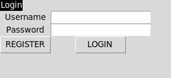
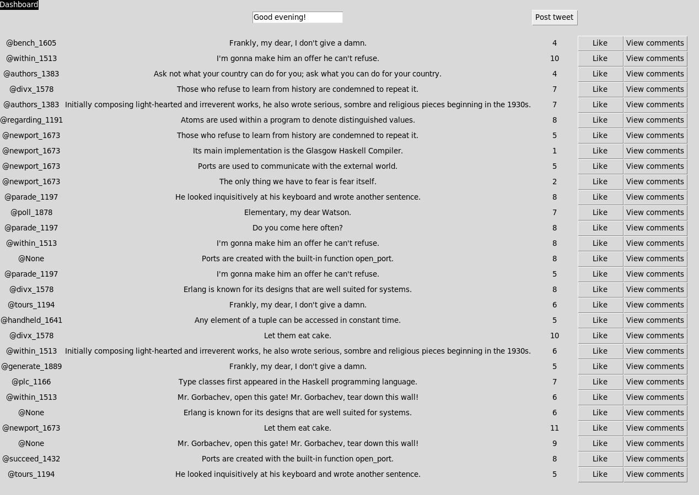

# Instructions 

1. Install dependencies

```bash
poetry install
```

2. Start application 

```bash
poetry run invoke start
```

Following, a *Tkinter* window should open with possibilities to login or register. 

A pre existing user can login to the application. With the *username* ``` chelseayu ``` and *password* ``` chelseayu_8746 ``` one can login.




A new user can register from the register - view. The user is notified if the username already exists.


The wall/dashboard shows all tweets. The user can like and write their own tweet. 


The user can comment on tweets and then navigate back to the wall of tweets.


